# 项目实验报告

## 1. 项目选题
**项目名称**: 使用 Rust 实现轻量级 Git  
**项目简介**: 本项目旨在使用 Rust 实现一个轻量级的 Git 系统，支持基本的版本控制功能，包括分支管理、文件跟踪、提交、合并等操作。

---

## 2. 小组成员信息
| 姓名   | 学号       | 分工                     |
|--------|------------|--------------------------|
| 陈翔宇   | 231220088   | 项目架构设计、代码实现、编写测试   |
| 黄睿智   | 231220075   | 代码实现、辅助测试      |


---

## 3. 项目需求
1. 支持基本的 Git 功能：
   - 初始化仓库（`init`）
   - 添加文件到索引（`add`）
   - 提交更改（`commit`）
   - 分支管理（`branch`、`checkout`）
   - 合并分支（`merge`）
2. 支持底层 Git 命令：
   - 修改暂存区（`update-index`、`read-tree`）
   - 生成基础的 Git 对象（`write-tree`、`commit-tree`、`hash-object`）
   - 修改分支引用（`update-ref`、`symbolic-ref`）
   - 监看 Git 对象（`cat-file`）
3. 提供命令行工具，用户可以通过命令行操作仓库。
4. 支持冲突检测，供使用者抉择。

---

## 4. 整体架构设计
### 4.1 模块划分
- **命令模块**: 处理用户输入的命令（如 `add`、`commit`、`merge`等）。
- **对象存储模块**: 负责存储和读取 Git 对象（如 `blob`、`tree`、`commit`）。
- **索引模块**: 管理暂存区（`index`）。
- **分支与引用模块**: 管理分支和 `HEAD` 指针。
- **文件系统模块**: 处理文件的读写操作。

### 4.2 流程图
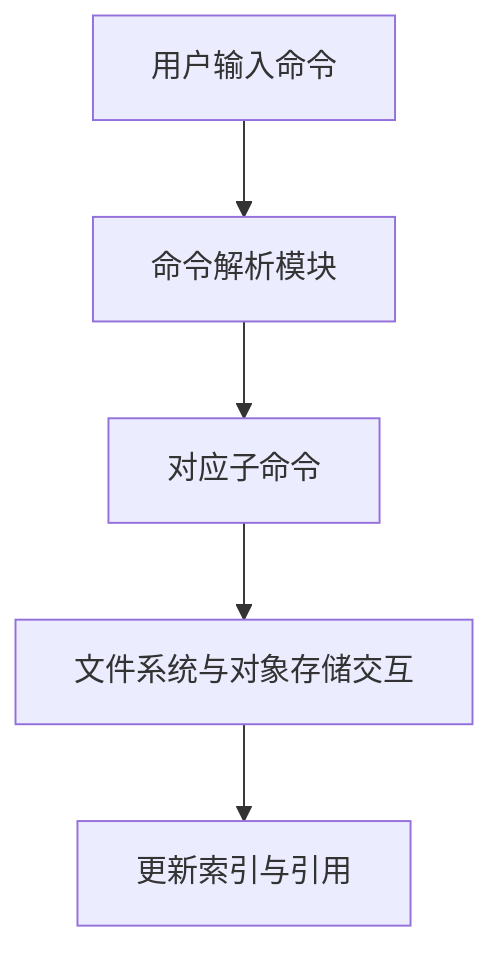

## 5. 功能实现

- **提交更改（commit）**:
    组织 index 的条目构建 tree object，得到 tree_hash，读取当前分支的最新提交作为 parent commit， 加上 author 、email 和 commit_message 作为 commmit object 的内容，然后 hash 得到commit hash，更新当前分支的ref，输出commit hash。

- **分支管理（branch）**:
    1. 无参数直接遍历 .git/refs/heads 中的文件输出当前所有分支，并比对当前 HEAD 指向的分支来标明当前分支
    2. 只加 branch_name 在 .git/refs/heads 下创建文件 branch_name，并写入当前分支的 commit hash。
    3. 加 delete 参数，目前是强制删除分支，保证不是删除当前所在分支的前提下移除 .git/refs/heads 下对应的文件。

- **分支切换和文件恢复（checkout）**:
1. 分支切换：
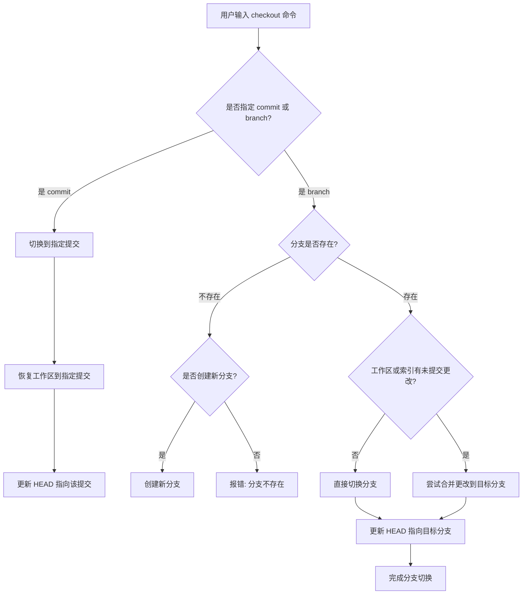

2. 文件恢复：
    若指定 commit hash 或 “HEAD”，获得 tree hash 从 tree content 中恢复指定文件，并修改 index 中该文件的对应条目；否则若 index 中有该文件条目，从 index 区恢复；否则失败。

- 暂存区的添加与删除
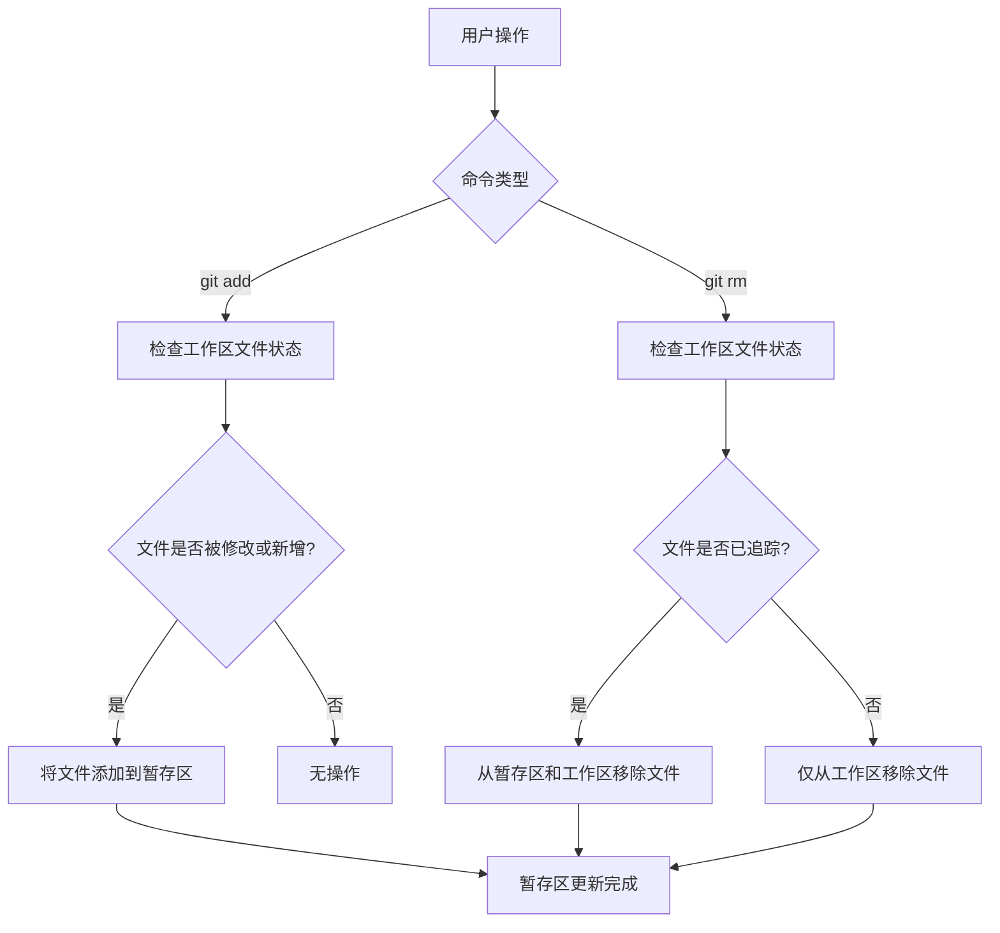

- 分支合并
1. fast-forward
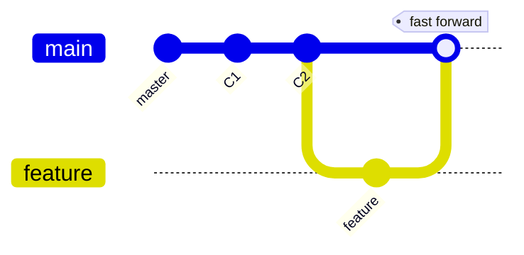

2. 三路合并(其实实际上实现为了二路合并)
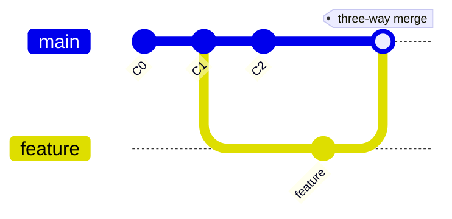
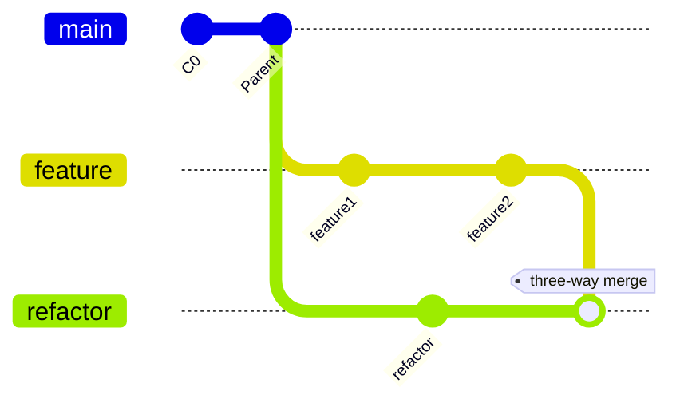

- just for fun

shell中的git仓库的提示到底是什么意思
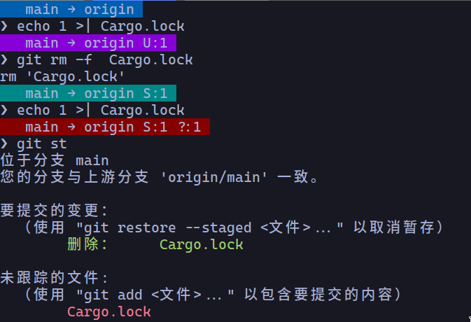

| ---              | 工作区与暂存区相同 | 缺少文件       | 工作区因为修改文件 | 工作区因为添加文件   |
| ---              | ---                | ---            | ---                | ---                  |
| 暂存区和仓库相同 | 收敛状态(蓝色)     | 修改状态(紫色) | 修改状态(紫色)     | 有未追踪的文件(红色) |
| 暂存区和仓库不同 | 准备提交阶段(青色) | 修改状态(紫色) | 修改状态(紫色)     | 有未追踪的文件(红色) |


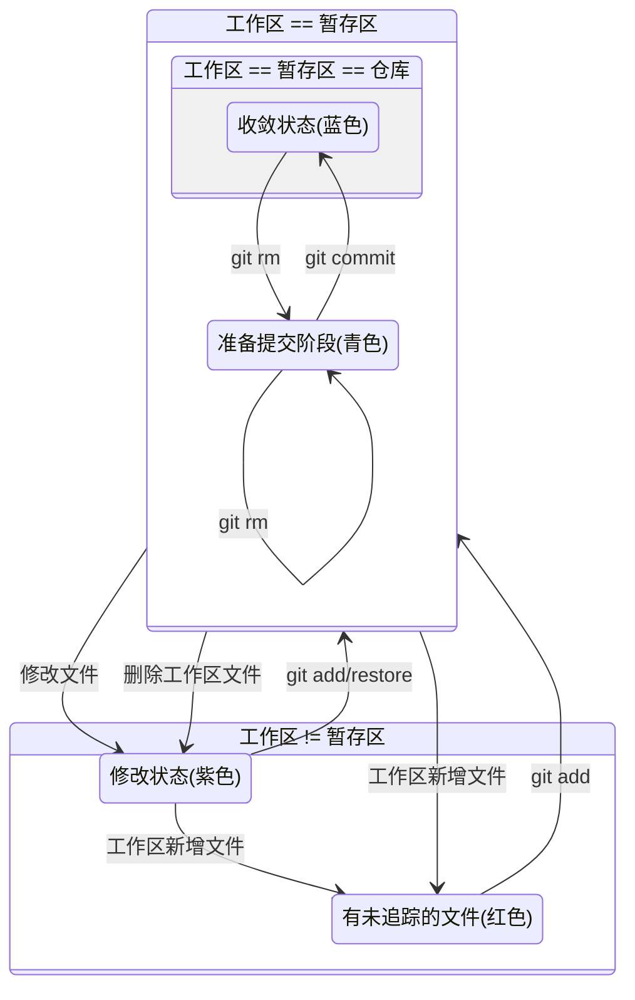

## 6. 测试和工作流
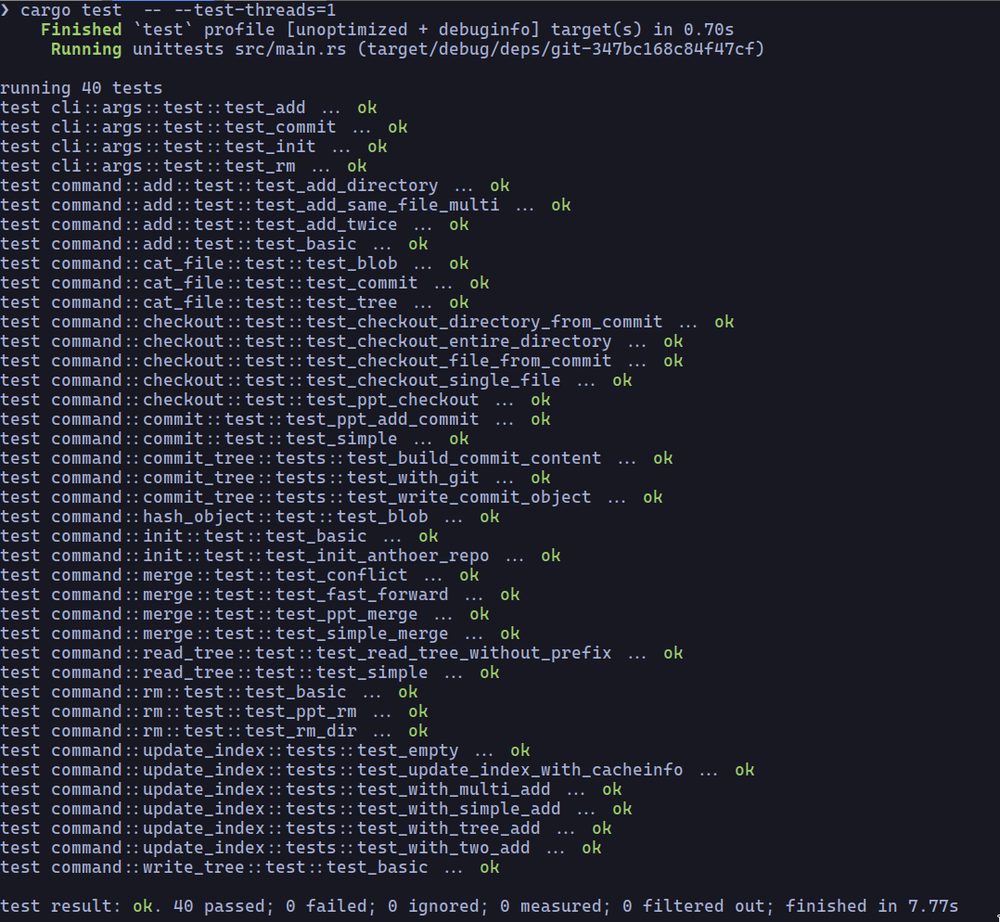
```yml
name: Rust CI

# 触发条件：当代码推送到仓库或创建 Pull Request 时触发
on:
  push:
    branches: [ '**' ]

jobs:
  build-and-test:
    runs-on: ubuntu-latest  # 使用最新的 Ubuntu 环境

    steps:
      # Step 1: 检出代码
      - name: Checkout code
        uses: actions/checkout@v3

      # Step 2: 设置 Rust 工具链
      - name: Set up Rust
        uses: actions-rs/toolchain@v1
        with:
          toolchain: stable  # 使用稳定的 Rust 工具链

      # Step 3: 运行 cargo test
      - name: Run Tests
        run: cargo test -- --test-threads=1

      # Step 4: 运行 cargo clippy 检查
      - name: Run Clippy
        run: cargo clippy -- -D warnings  # 将警告视为错误

      # （可选）Step 5: 构建项目
      - name: Build Project
        run: cargo build --release
```
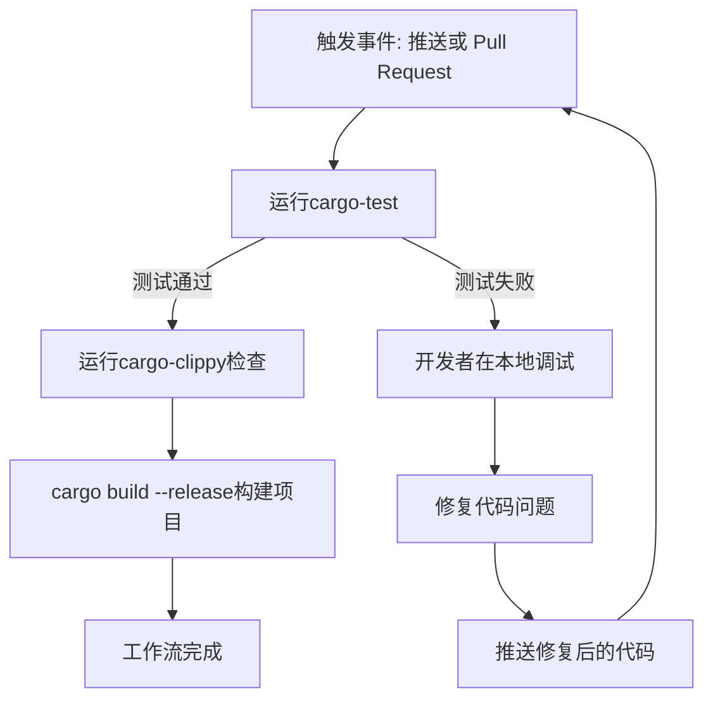
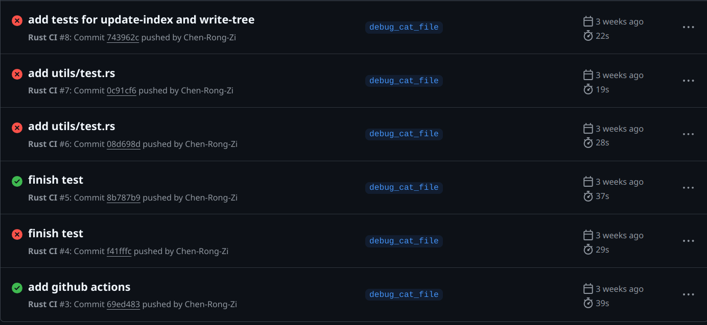
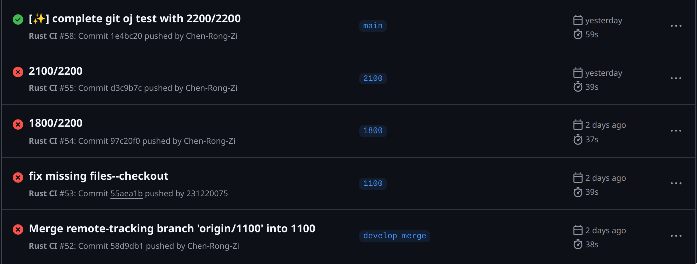


## 7.问题总结
1. 最初实现 checkout 的时候对其功能认知有偏差，以为切换分支和恢复文件相耦合，后来在队友的提醒下增加了单独恢复文件/目录的逻辑。
2. checkout 切换分支的实现是用目标分支的文件树覆盖 index 区，并修改工作区。但如果当前分支的 index 追踪了目标分支不存在的文件A，切换分支后会多出A，所以在切换前应该删除工作区中所有被暂存在 index 区中的文件，然后再把目标分支的文件树覆盖 index 区和写入工作区。
3. 起初对 index 区和tree object 的认识比较浅薄。实际上 index 区的每个条目存储的是完整的路径
而不是像 tree object 一样是递归存储的。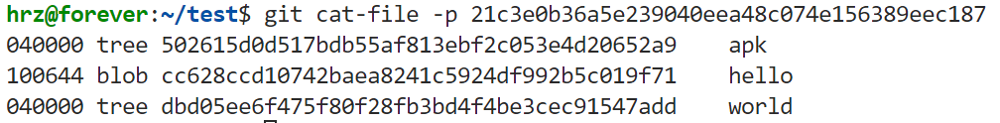这一点不同导致在 checkout 恢复文件的时候出现了一些问题，诸如直接拿 index 存储的 path 去创建文件，实际要先 create_dir_all(path.parent()) 确保父目录存在，否则会创建失败。


## 8.项目总结
- **收获**:
    - 深入了解了 Git 的内部实现原理和细节。
    - 加深了对 rust 所有权机制、问题处理和特型等的理解，在队长的带领下提升了团队协作能力和 rust 编程能力。

- **不足**:
    - 只实现了基本功能，原计划的远程操作功能未能完成。希望课程结束后继续完善，暑期优化一下。
    - 在写出该质量代码的目标上还有很远的路要走。


